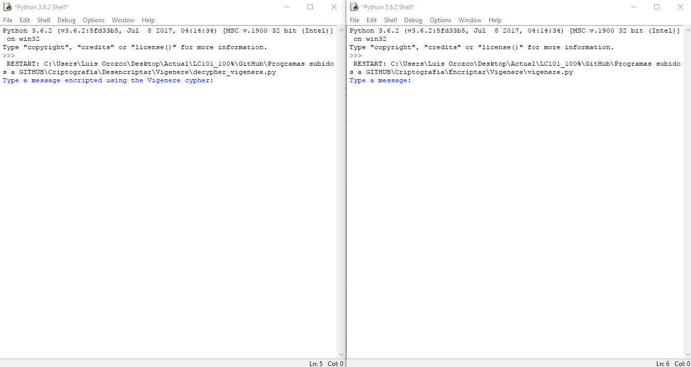

# Vigenere_Cypher_Python
Version of the Cipher Vigenere using Python 3



This program is a version of the Vigenere Cypher using Python 3. 
It works!!! If you want to send a message (✉️) to somebody and you dont want somebody_else_that_doesnt_know_nothing_about_cyphers_programming_or_internet to know what your ✉️ says, you can use this program. If you want to know more about the Vigenere Cipher itself, watch the next video (click on the screen below).

<a href="https://www.youtube.com/watch?v=9zASwVoshiM&feature=youtu.be">

</a>

## Getting Started

Get a copy of the project by downloading the three python files located in the folder named **python_format_files** (the ones that end in *.py*) and save them in the same folder in your computer. For running the project on your computer please read the Instructions below.

### Prerequisites
You would have to have an IDE (Interface Development Environment) software that lets you execute Python files in your computer. The python IDE is free and can be directly downloaded from the python website [here.](https://www.python.org/downloads/release/python-363/)

```
link: https://www.python.org/downloads/release/python-363/
```

## Instructions (to make it work): 
The procedure is the same as the one explained in the next video for the Caesar Cipher (click on image below).

<a href="https://youtu.be/ezf69cKpxjE">

</a>

```
link: https://youtu.be/ezf69cKpxjE
```


## Built With

* [Dropwizard](http://www.dropwizard.io/1.0.2/docs/) - The web framework used
* [Maven](https://maven.apache.org/) - Dependency Management
* [ROME](https://rometools.github.io/rome/) - Used to generate RSS Feeds

## Contributing

Please read [CONTRIBUTING.md](https://gist.github.com/PurpleBooth/b24679402957c63ec426) for details on our code of conduct, and the process for submitting pull requests to us.

## Versioning

We use [SemVer](http://semver.org/) for versioning. For the versions available, see the [tags on this repository](https://github.com/your/project/tags). 

## Authors

* **Luis Orozco** - *Initial work* - [LuisOC89](https://github.com/LuisOC89)

See also the list of [contributors](https://github.com/LuisOC89/Caesar_Cypher_Python/contributors) who participated in this project.

## License

This project is licensed under the MIT License - see the [LICENSE.md](LICENSE.md) file for details

## Acknowledgments

* I wouldnt have created this code without LaunchCode Tampa Fall 2017. Thanks for the knowledge and the good ideas.
